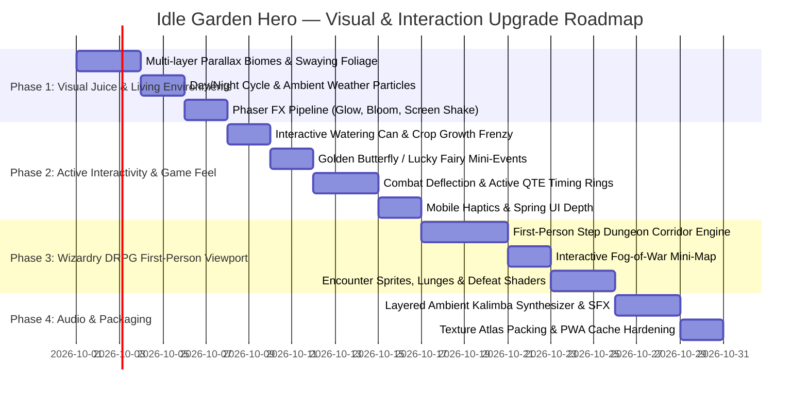

# 🌿 Idle Garden Hero — Graphics & Interaction Upgrade Plan (Hand-off)

> **Document Version:** 1.0.0  
> **Status:** Approved Roadmap  
> **Target Platform:** Web / Mobile PWA, optionally embedded in same-origin Chat with account saves
> **Target Frameworks:** Phaser 3.90+ (WebGL/Canvas), Native HTML5/CSS, Web Audio API, Service Worker  

---

## 1. Executive Summary & Objective

**Idle Garden Hero** has a mathematically balanced idle engine, offline calculation, local saves, and optional same-origin Chat account saves. The server keeps a strict Content Security Policy (CSP).

However, while **core gameplay mechanics** are solid (hero progression, combat formulas, prestige/Bloom Anew, and Wizardry turn-based tactics), the **visual presentation and player interactions** are currently basic:
- The game visually relies heavily on static HTML cards and flat CSS gradients.
- Visual animations are limited to 2D squash-and-stretch tweens and basic projectile dots.
- Legion troops are displayed merely as emoji icons on small circles.
- The Wizardry dungeon-crawler experience is presented entirely as a text/table modal rather than an immersive dungeon crawl.
- Interactive mechanics are limited to standard clicking without tactile feedback, gestures, or active engagement opportunities.

**Goal:** Transform Idle Garden Hero into a visually enchanting, juicy, and tactile cozy RPG that captivates players on both mobile and desktop while maintaining high performance (60 FPS) and lightweight resource footprint.

---

## 2. Current State vs. Target State Gap Analysis

| Feature Area | Current State (Baseline) | Target State (Upgraded Vision) |
| :--- | :--- | :--- |
| **Garden Environment** | Static background color with HTML grid cards | Multi-layered parallax meadow with day/night lighting, weather effects (rain, sunbeams, fireflies), and swaying foliage. |
| **Hero & Unit Visuals** | Static WebP portraits with simple vertical bounce | Animated idle breathing, unique tap chatter emotes, weapon glows, and distinct animated chibi sprites for Legion troops (Scouts, Archers, Guardians). |
| **Active Garden Interactivity** | Plain clicking on hero plots for small leaf payout | Interactive watering can drag-and-spritz for growth frenzies; wandering Golden Butterflies/Dewdrop Fairies triggering mini-events. |
| **Combat Visuals & Juice** | Small linear colored projectile dots flying to enemy | Impact flashes, directional particle arcs, dynamic hit-stop, camera shake on criticals, and animated slash/magic VFX overlays. |
| **DRPG / Wizardry Dungeon** | HTML text table with dropdown tactics modal | First-person pseudo-3D grid dungeon view with stone walls, atmospheric torchlight, interactive mini-map with fog-of-war, and front-view enemy encounter sprites. |
| **Combat Interactivity** | Completely passive auto-battler (except 1 ult button) | Active Time Events: timed deflection taps to parry enemy spores, drag-to-aim Ultimate skills, and combo hit timing. |
| **Tactile & Audio Feedback** | Single oscillator Web Audio beeps, no haptics | Layered melodic soundscapes, tactile physical UI buttons with spring physics, and mobile haptic vibration (`navigator.vibrate`). |
| **Asset Pipeline** | 12+ separate WebP HTTP requests | Consolidated WebP Texture Atlases, reducing asset roundtrips to 1-2 network requests with instant PWA cache. |

---

## 3. Pillar 1: Visual Fidelity & Living Environments

### 3.1 Multi-Layered Parallax Biomes
Each biome must come alive with depth and atmospheric personality:
1. **Biome Background Stacks (3 Depth Layers):**
   - **Sky & Far Backdrop (0.2x Parallax):** Moving clouds, distant mountain ridges, rising sun/moon.
   - **Midground (0.5x Parallax):** Ancient giant oak trees, fairy rings, crumbling ivy stone ruins.
   - **Foreground (1.0x Parallax):** Swaying tall grass, blooming buttercups, interactive plot soil.
2. **Biome Themes:**
   - **Forest Glade (Waves 1-20):** Bright, dappled sunlight, dandelion fluff floating in the wind.
   - **Bramble Maze (Waves 21-50):** Deep violet-green shadows, thorny vines, luminescent mushrooms.
   - **Whispering Grove (Waves 51-80):** Autumnal amber leaves swirling, enchanted mist drifting horizontally.
   - **Ancient Redwood (Waves 81-110):** Colossal mossy trunks, golden shafts of sunlight (god rays).
   - **Sunken Crypts (Waves 111-150):** Eerie blue torchlight, floating ghost spores, cracked stone tiles.

### 3.2 Dynamic Weather & Time-of-Day System
- **Day/Night Cycle:** Subtle color temperature tweening every 15 minutes (or synchronized with player's local clock):
  - *Morning (06:00 - 11:00):* Warm golden tint (`#fff9e6`), high saturation.
  - *Afternoon (11:00 - 17:00):* Crisp daylight, vibrant greens (`#f0fff4`).
  - *Dusk (17:00 - 20:00):* Magenta/orange glow (`#ffd1b3`), soft shadows.
  - *Night (20:00 - 06:00):* Cool deep indigo (`#1a233a`), glowing flowers and fluttering fireflies.
- **Weather Particles:**
  - *Gentle Spring Rain:* Diagonal translucent streaks with puddle ripples on the garden soil.
  - *Sunbeam Drift:* Golden dust motes dancing in light cones.

### 3.3 GPU-Accelerated Phaser FX Pipeline
- Utilize Phaser 3's built-in WebGL post-processing:
  - **Bloom & Glow:** Applied to magical staff tips (Rose Mage), holy shields (Sprout Knight), and Ultimate bursts.
  - **Chromatic Aberration & Screen Shake:** 60ms subtle pulse during critical strikes or boss roars.
  - **Vignette:** Darkens outer edges during dungeon combat to heighten focus.

---

## 4. Pillar 2: Micro-Interactions & "Game Feel" (Juiciness)

### 4.1 Interactive Garden Tools & Mini-Mechanics
1. **Interactive Watering Can:**
   - A floating golden watering can icon on the UI.
   - Player can drag or click to pour water droplets over hero plots.
   - *Reward:* Waters a plot to activate a 15-second **"Lush Bloom"** buff (+50% Leaf Points/sec and faster attack rhythm).
2. **Lucky Wandering Critters (Surprise Events):**
   - Every 60-120 seconds, a **Golden Butterfly** or **Rainbow Dewdrop** flutters across the screen on a curved Bezier path.
   - Tapping it before it leaves awards a random jackpot:
     - *Golden Harvest:* Instant 30 seconds of passive LPS.
     - *Frenzy Tap:* Next 10 taps yield 5x reward and burst confetti.
     - *Seed Shard:* +1 bonus Golden Seed fragment.
3. **Hero Personality & Emote Bubbles:**
   - Tapping a hero triggers not only a squash-and-stretch bounce, but also an animated speech bubble with whimsical reaction emotes (`❤️`, `⚔️`, `💤`, `🌸`, `✨`) and randomized cozy sound chimes.

### 4.2 Active Combat Micro-Interactions
1. **Parry / Deflection System ("Spore Swatter"):**
   - Enemies periodically launch slow-moving thorny seeds or toxic spores towards the party.
   - If the player taps the incoming projectile mid-flight:
     - It deflects back towards the enemy for bonus damage!
     - Prevents incoming party damage for that attack cycle.
2. **Critical Timing Tap (Active Action Time):**
   - When a hero launches their signature skill, a golden ring contracts toward their icon.
   - Tapping when the ring aligns triggers **"PERFECT STRIKE"** (2.0x damage + dazzling particle burst).
3. **Interactive Ultimate Skill (Sunlight Burst):**
   - Instead of a single button press, player drags the Sunlight Orb to drop it onto the enemy, allowing a feeling of physical empowerment.

---

## 5. Pillar 3: Wizardry-Style First-Person DRPG Viewport

The turn-based tactics system (`src/game-engine.js: advanceTacticalTurn`) is already modeled after classic dungeon crawlers (front-row tanking, back-row magic, stamina management, and skill selections). The UI must visually reflect this dungeon heritage!

```
+--------------------------------------------------------------+
| [DUNGEON FLOOR B3: BRAMBLE CRYPT]               [STEP: 14/20] |
+--------------------------------------------------------------+
|       +------------------------------------+   [ MINI-MAP ]  |
|      /|                                    |\   [#][#][ ]    |
|     / |      [ ENEMY: BRAMBLE TROLL ]      | \  [ ][P][#]    |
|    |  |               (85% HP)             |  | [ ][ ][ ]    |
|    |  |                                    |  | Facing: N    |
|    |  |                                    |  | Torch: 85%   |
|     \ |                                    | /               |
|      \|                                    |/   [PARTY STATUS]|
|       +------------------------------------+    Sprout: 120HP |
+-------------------------------------------------+ Rose:   85HP  |
| [1] ATTACK      [2] CAST SPELL    [3] DEFEND    | Oak:    160HP |
| [4] FLEE        [5] USE ITEM      [6] AUTO-RUN  | Energy:  72%  |
+---------------------------------------------------------------+
```

### 5.1 Pseudo-3D Step Corridor Renderer
- Render classic first-person dungeon corridors using canvas 2.5D raycast or pre-rendered tile wall segments:
  - Front wall, left wall, right wall, ceiling beams, stone floor.
  - Directional navigation: Move Forward (`W`/`▲`), Turn Left (`A`/`◄`), Turn Right (`D`/`►`), Step Back (`S`/`▼`).
  - Dungeon torch flicker effect: warm radial gradient fluctuating in intensity and radius.

### 5.2 Dynamic Fog-of-War Mini-Map
- An 8x8 grid rendering current room tiles:
  - Visited tiles: revealed in crisp parchment style.
  - Unvisited tiles: shrouded in dark fog.
  - Party position: marked by a cute compass arrow indicating facing direction (`N`, `S`, `E`, `W`).
  - Special landmarks: Chests (`🎁`), Stairs (`🪜`), Traps (`⚠️`), and Boss chamber (`👑`).

### 5.3 First-Person Encounter Sprites
- When encountering an enemy:
  - Enemy sprite scales up from the hallway depth onto the center screen with an ominous entrance sound.
  - Idle breathing tween with subtle scale oscillations.
  - When attacking, enemy lunges toward the camera viewport.
  - On defeat, enemy dissolves with a pixelation or burn-away particle shader.

---

## 6. Pillar 4: Tactile UI/UX & Audio Engineering

### 6.1 Tactile "Cozy Naturalist" UI Components
1. **Button Springs & Micro-Transitions:**
   - Replace instant flat state switches with CSS spring curves (`cubic-bezier(0.34, 1.56, 0.64, 1)`).
   - Pressing a button slightly compresses it (`transform: scale(0.96) translateY(2px)`), casting an inset shadow for satisfying physical depth.
2. **Floating Combat Text Physics:**
   - Damage numbers pop upward with an initial randomized velocity, arc outward under simulated gravity, and fade away with crisp text shadows.
   - Critical damage: double size, gold/amber color with particle sparkles.
   - Healing text: emerald green with upward floating clover leaves.
3. **Mobile Haptics Engine:**
   - Implement `navigator.vibrate` integration with fallback checks:
     - Light tap on hero/button: `vibrate(10)`
     - Critical strike: `vibrate([20, 30, 20])`
     - Boss defeat / Stage clear: `vibrate([40, 60, 40, 80, 100])`

### 6.2 Layered Procedural Audio System
Extend `src/audio.js` with richer polyphonic synthesizer presets:
- **Garden BGM:** Gentle chord arpeggios on sine/triangle waves resembling a Kalimba or music box, mixed with ambient bird song and breeze noise filters.
- **Combat BGM:** Driving bass pulse with rhythmic staccato pluck sounds.
- **Dungeon Ambience:** Low reverb droning with intermittent water drop pings and distant echoes.
- **SFX Palette:**
  - Water splash (`bandpass` filtered noise envelope).
  - Sword slash (`highpass` filtered sweep with quick decay).
  - Chest opening (ascending 3-chord major chime).

---

## 7. Pillar 5: Asset Pipeline & Performance Optimization

Since Idle Garden Hero is served over the network from a static container:
1. **Texture Atlas Compilation:**
   - Bundle all 12+ individual hero and enemy WebP sprites, plus new UI icons and dungeon textures, into a single optimized Texture Atlas (`atlas-characters.webp` + `atlas-characters.json`).
   - Cuts HTTP requests from ~20 roundtrips down to 1.
2. **PWA Offline Pre-caching:**
   - Update `public/sw.js` to automatically pre-cache the texture atlas, audio synthesis tables, and core bundles upon installation.
3. **Scalable Viewport Architecture:**
   - **Mobile Portrait (Aspect 9:16 - 9:19):** Top viewport holds the interactive visual canvas; bottom half holds quick-access tabs, upgrade drawers, and thumb-friendly buttons.
   - **Desktop Widescreen (Aspect 16:9 - 21:9):** Dashboard layout displaying Garden on the left and Dungeon Crawler on the right simultaneously, with zero layout shift.

---

## 8. Implementation Roadmap & Phased Execution



### Milestone Deliverables

#### Milestone A: "Living Glade" (Days 1–5)
- [x] Add 3-layer parallax scrolling backgrounds for all 5 Biomes.
- [x] Implement day/night color grading and dynamic rain/sunbeam particle emitters.
- [x] Add hit-stop and subtle screen shake to combat critical strikes.

#### Milestone B: "Tactile Garden" (Days 6–9)
- [x] Implement draggable Watering Can tool with temporary boost mechanics.
- [x] Add wandering Golden Butterflies with reward jackpots on tap.
- [x] Integrate mobile vibration API (`navigator.vibrate`) across all interactions.
- [x] Upgrade combat projectiles with colored light trails and directional impact sparks.

#### Milestone C: "The Garden Crypts" (Days 10–14)
- [ ] Build first-person pseudo-3D dungeon hallway viewport for Wizardry mode.
- [ ] Implement interactive Fog-of-War mini-map with cardinal direction compass.
- [ ] Implement Spore Swatter deflection mechanic (tap enemy attacks mid-air).

#### Milestone D: "Polishing & Optimization" (Days 15–16)
- [ ] Pack hero and enemy sprites into unified WebP Texture Atlas.
- [ ] Enrich procedural Web Audio engine with Kalimba ambient BGM.
- [ ] Run full automated test suites and audit 60 FPS mobile performance.

---

## 9. Verification & Quality Gates

To ensure no regressions in performance, gameplay, or security:
1. **Performance Gate:**
   - Must maintain stable **60 FPS** on mid-tier mobile devices (e.g. Snapdragon 700 series / Apple A12+).
   - Draw calls per frame in Phaser must remain below **25**.
   - Total runtime memory must stay under **80 MB**.
2. **Save & State Integrity:**
   - All visual additions must be purely cosmetic or interface layers; core game math and state must remain fully serialized through `sanitizeSave()`.
   - 100% backward compatibility with existing saves in `localStorage`.
3. **Security Invariant:**
   - Maintain the strict Content Security Policy (`script-src 'self'`, `frame-ancestors 'self'`, browser requests limited to the same origin).
   - Zero remote tracking or external telemetry.
4. **Automated Testing:**
   - All 51 current unit & regression tests must continue to pass without errors.
   - Add new unit tests for dungeon step traversal, mini-map fog-of-war exploration, and interactive buff timers.

---

*Authored by Antigravity AI Engineering Team for Idle Garden Hero.*
