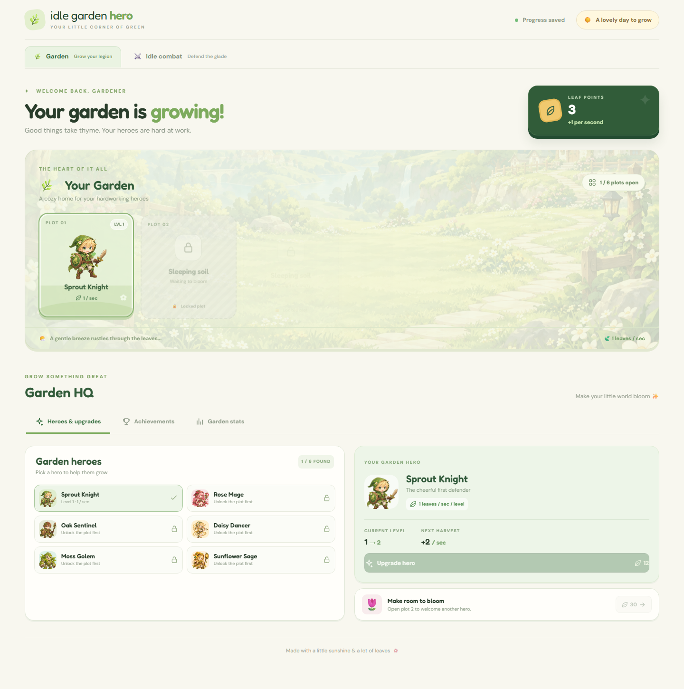
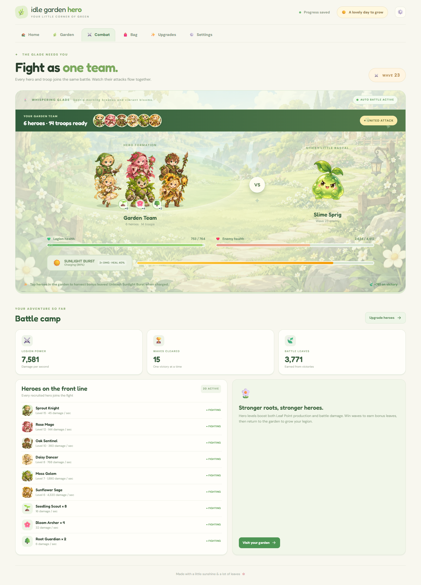

# 🌿 Idle Garden Hero

> A cozy, mobile-friendly incremental idle garden game with active tap harvesting, automated RPG glade defense, Phaser 3 animations, built-in Web Audio synthesis, and an Ancient Artifact prestige system.

[](https://github.com/quyenanh198/Idle-Garden-Heroes/actions/workflows/build.yml)
[](test/game-engine.test.js)
[](https://vitejs.dev/)
[](https://phaser.io/)
[](LICENSE)

---

## 📸 Screenshots

| 🌿 Cozy Garden HQ | ⚔️ Auto-Battle & Biomes |
| :---: | :---: |
|  |  |

[View the mobile team battle](screenshots/combat-team-mobile.png).

---

## ✨ Key Features & Gameplay

### 1. 🌿 Cozy Garden & Active Tap-Harvesting
- **Idle Production:** Your recruited heroes generate **Leaf Points (LPS)** every second, working quietly even when exploring other screens or closed.
- **Active Tapping:** Tap directly on any unlocked hero plot to trigger instant harvests based on hero level and boosts.
- **Critical Taps:** 12% chance to land a **💥 CRIT!** for **3× leaf payout**, accompanied by dynamic gold floating text and squash-and-stretch particle bursts.
- **Plot Expansion:** Unlock up to 6 garden plots to welcome new heroes with escalating production rates.

### 2. 🏰 Wizardry™-Like Dungeon Crawler & Turn-Based Tactics
- **1st-Person Perspective Corridor:** Atmospheric dungeon crawler corridor with flickering torches, depth tracker (`DEPTH B<F>F · ROOM <R>`), stone masonry perspective, and retro scanline battle aesthetic.
- **Front & Back Row Formations:**
  - **🛡️ Front Row (Vanguard):** Absorbs 75% of single-target enemy attacks and acts as a shield for rear squishies.
  - **🏹 Back Row (Rearguard):** Receives 30% reduced damage, providing a safe haven for mages and healers to cast spells uninterrupted.
- **Distinct Hero Skill Actions:**
  - *Sprout Knight:* Basic Strike (1.0×), Sprout Guard (+30% party mitigation), Thorn Cleave (1.5×).
  - *Rose Mage:* Petal Rain (1.35×), Thorn Barrage (1.8×), Sylvan Ward (+25% mitigation).
  - *Oak Sentinel:* Heavy Branch Bash (1.1×), Iron Bark Guard (+35% party mitigation), Root Taunt (draws attacks).
  - *Daisy Priest:* Pollen Blossom (Restores 22% Party HP), Meadow Grace (Restores 35% Party HP), Daisy Dart (1.0×).
  - *Moss Golem:* Boulder Smash (1.65×), Moss Armor (+40% party mitigation), Creeping Spores (Poison DoT).
  - *Sunflower Sage:* Solar Beam (2.2×), Radiant Dawn (Heals +15% HP & +15% Ult Energy), Solar Flares (1.5×).
- **Preset Auto & Manual Tactics:**
  - **⚡ Auto-Battle Mode:** Follows your saved party formation, attack order priority, and skill presets every turn.
  - **🕹️ Manual Step Mode:** Pause continuous battle and step through individual turns (`EXECUTE TURN ➔`) with full tactical oversight.
- **Tactics Configuration Modal:** Easily switch heroes between Front and Back rows, re-order attack priority (1st through 6th), and select skill presets with instant auto-save.
- **Retro Typewriter Combat Log:** Live terminal feed detailing every hero strike, healing blossom, shield activation, enemy retaliation, and boss defeat.
- **5 Themed Biomes:** Journey across 150 progressive combat waves:
  - 🌼 **Whispering Glade** *(Waves 1–25)*
  - 🌵 **Thorny Thicket** *(Waves 26–50)*
  - 🐸 **Misty Swamp** *(Waves 51–75)*
  - 🌲 **Ancient Redwood** *(Waves 76–100)*
  - 🌙 **Twilight Grove** *(Waves 101–150)*
- **Stalemate Feedback:** If the legion can't beat the current wave, the battle banner switches to *"Legion too weak · upgrade to advance"* instead of looping silently.
- **Boss Waves:** Face formidable shadow bosses every 5 waves for elevated Leaf Point rewards.
- **Tactile Combat VFX:** Hero-specific color projectiles, enemy spore attacks with party pushback, hit spark reactions, and floating damage numbers.

### 3. 📈 Hero Leveling & Multi-Layered Power Scaling
Hero progression forms the backbone of both your garden economy and dungeon crawling strength through an exponential multi-layered scaling architecture:

- **Exponential Upgrade Costs:**
  Hero upgrade costs scale by **+32% per level** following the formula:
  $$\text{Cost}(\text{level}) = \lceil \text{upgradeBase} \times 1.32^{(\text{level} - 1)} \rceil$$
- **Triple-Pillar Level Growth:**
  Every level invested into a hero elevates three distinct capabilities:
  1. **Passive Leaf Production (LPS):**
     $$\text{LPS}_{\text{hero}} = \text{Level} \times \text{baseLps} \times \text{harvestMultiplier}$$
     Scaled by *Golden Watering Can* (+25%/lvl), *Fertile Soil* (+20%/lvl), and *Leaf Charm* (+10%).
  2. **Combat Attack Power (DPS):**
     $$\text{Power}_{\text{hero}} = \text{Level} \times \text{baseLps} \times 3 \times \text{powerMultiplier}$$
     Scaled by *Training Grounds* (+20%/lvl), *Sunlight Crystal* (+15%/lvl), *Rose Brooch* (+15%), and *Sunlight Burst* (2×).
  3. **Party Vitality (Max HP):**
     Every single hero level grants permanent **+10 Max HP** to the shared party health pool and immediately restores 10 HP to the active battle:
     $$\text{Max HP}_{\text{party}} = 100 + \sum (\text{Level}_{\text{hero}} \times 10) + \text{HP}_{\text{legion}} + \text{HP}_{\text{boosts/relics/badge}}$$
- **Active Tap Harvest Scaling:**
  Tapping a hero plot yields instant rewards proportional to their level and base LPS:
  $$\text{Tap Yield} = \lceil (\text{baseLps} \times \text{Level} \times 0.5) \times \text{harvestMultiplier} \times (3 \text{ on 12% Crit}) \rceil$$
- **DRPG Skill Scaling:**
  In the Wizardry turn engine, specialized hero attacks (such as Rose Mage's *Thorn Barrage* at 1.8× or Sunflower Sage's *Solar Beam* at 2.2×) calculate damage directly from the hero's base power (`baseLps * 3 * level`), while healing blossoms restore percentages of the party's ever-growing Max HP.
- **Prestige Amplification (Bloom Anew):**
  When transcending the glade at Wave 25+, Golden Seeds fund permanent ancient artifacts that dramatically multiply the power gains of each level in subsequent cycles.

### 4. ☀️ "Sunlight Burst" Ultimate Skill
- **Energy Gauge:** Charges passively at 4%/sec and gains +5% bonus on every wave victory.
- **Unleash the Sunlight:** When 100% full, trigger **Sunlight Burst** to:
  - Instantly restore **40% Party Max HP**.
  - Boost **Combat Power by 2×** for 8 seconds.
  - Illuminate the battlefield with radiant sunbeams and radial starburst particles.

### 5. 🌸 "Bloom Anew" Prestige System & Ancient Relics
- **Transcend the Glade:** Unlocks at **Wave 25+**. Reset heroes, plots, and battle progression to harvest cosmic **Golden Seeds** (scaled by wave depth, wins, and lifetime harvested leaves).
- **Persistent Progress:** All equippable Bag treasures, Golden Seeds, and Ancient Artifacts persist across resets. Accessories unlock from *lifetime* wave wins, so a bloom never re-locks them.
- **5 Ancient Artifacts:**
  1. 💎 **Sunlight Crystal:** `+15%` Combat Power per level.
  2. 🌱 **Fertile Soil:** `+20%` Tap & LPS Harvest per level.
  3. 🌳 **Eternal Root:** `+60` Party Max HP per level.
  4. ✨ **Golden Dew Bucket:** `+25%` Ultimate Energy Charge Rate per level.
  5. 🍀 **Clover of Fortune:** `+20%` Wave Reward leaves per level.

### 6. 🎵 Built-in Cozy Web Audio Synthesizer
- **Zero-Dependency Audio:** Synthesized entirely via the browser's native `AudioContext` (no external MP3/WAV downloads, zero latency, zero bandwidth bloat).
- **Hero-Specific Tones:** Distinct attack signatures (Sprout Knight sword sweep, Rose Mage crystal chime, Oak Sentinel deep thud, Sunflower Sage warm harmonic chord).
- **Full Soundscape:** Tap harvest notes, crit fanfare, enemy spore impacts, level-up chimes, wave victory jingles, ultimate roar, and cosmic bloom melody.
- **Mute & Volume Control:** Toggle sound effects and set a master volume in Settings, both saved locally.

### 7. 🎒 Bag, Accessories & Upgrades
- **Accessories:** Earn unique relics (Leaf Charm, Rose Brooch, Oak Badge, Sunstone Pendant) by achieving battle win milestones.
- **Permanent Leaf Boosts:** Spend Leaf Points on *Golden Watering Can* (+25% harvest), *Training Grounds* (+20% power), and *Healing Spring* (+40 HP).
- **Legion Recruitment:** Train Seedling Scouts, Bloom Archers, and Root Guardians to support your party in both harvest and war.

### 8. 💤 Offline Progression
- Automatically computes up to **8 hours** of offline harvest and wave advancement on tab return.
- **Anti-Stalemate Protection:** Halts combat loops in `<1ms` if the party reaches an impasse, eliminating browser freezing or battery drain.

---

## 👥 Roster & Units

### Garden Heroes

| Hero | Plant Type | Role | Base LPS | Upgrade Base | Unlock Plot |
| :--- | :---: | :--- | :---: | :---: | :---: |
| **Sprout Knight** | 🌱 | Brave Sprout | `1.0` / sec | 12 🍃 | Plot 1 (Default) |
| **Rose Mage** | 🌹 | Thorn Sorceress | `4.0` / sec | 55 🍃 | Plot 2 (65 🍃) |
| **Oak Sentinel** | 🌳 | Glade Guardian | `12.0` / sec | 180 🍃 | Plot 3 (280 🍃) |
| **Daisy Dancer** | 🌼 | Meadow Sprite | `32.0` / sec | 560 🍃 | Plot 4 (980 🍃) |
| **Moss Golem** | 🪨 | Ancient Protector | `90.0` / sec | 1,800 🍃 | Plot 5 (3,400 🍃) |
| **Sunflower Sage** | ☀️ | Solar Luminary | `240.0` / sec | 6,200 🍃 | Plot 6 (11,000 🍃) |

### Legion Troops

| Troop | Emoji | Harvest Rate | Combat Power | HP Bonus |
| :--- | :---: | :---: | :---: | :---: |
| **Seedling Scout** | 🌱 | `+0.3` / sec | `+0.4` | `+12` HP |
| **Bloom Archer** | 🌸 | `+1.2` / sec | `+1.8` | `+25` HP |
| **Root Guardian** | 🌳 | `+3.0` / sec | `+4.5` | `+60` HP |

---

## 🛠️ Architecture & Tech Stack

```
Idle Garden Hero/
├── .github/workflows/build.yml   # CI pipeline: test, build
├── art-source/                   # Full-size PNG originals (not shipped)
├── public/
│   ├── assets/                   # 12 WebP illustrations for heroes & foes
│   ├── favicon.svg, manifest.webmanifest, sw.js  # Icon, install manifest, offline service worker
├── screenshots/                  # README & review screenshots
├── src/
│   ├── game-engine.js            # Pure decoupled math, formulas, combat sim & save sanitization
│   ├── format.js                 # Shared number formatting (K … Dc, then scientific)
│   ├── audio.js                  # Native Web Audio API synthesizer with master volume
│   ├── visuals.js                # One Phaser 3 game, Garden & Combat scenes; canvas follows the active screen
│   ├── main.js                   # UI controller, routing, click handlers, tick loop & multi-tab guard
│   ├── preflight.css             # Vendored CSS reset (Tailwind v4 preflight, MIT)
│   └── style.css                 # Custom cozy responsive design
├── server/
│   └── server.js                 # Hardened static HTTP server with strict CSP & security headers
├── test/
│   ├── game-engine.test.js       # Engine unit tests (Node.js Test Runner)
│   ├── security.test.js          # Security headers, anti-clickjacking & traversal tests
│   ├── regressions.test.js       # Regression & boundary edge case tests
│   ├── tap-pose.test.js          # Phaser animation & squash/stretch tests
│   └── format.test.js            # Number formatting tests
├── HANDOFF.md                    # Detailed roadmap for graphics, animation & interaction upgrades
├── AUDIT.md                      # In-depth architectural audit & optimization report
├── ASSETS.md                     # Asset catalog & illustration prompts
├── package.json
└── vite.config.js
```

### Key Technical Highlights
- **Decoupled Engine (`src/game-engine.js`):** All mathematical formulas, scaling functions, combat simulation steps, and save sanitization are 100% pure functions with zero DOM or browser dependencies, allowing automated headless testing.
- **Hybrid Rendering Architecture:** Uses native semantic HTML and hand-written CSS for snappy accessibility, combined with transparent Phaser 3 canvas overlays for particle bursts, squash-and-stretch tweens, and projectile physics.
- **Save Sanitization (`sanitizeSave`):** Guarded against `NaN`, `Infinity`, negative bounds, and corrupted JSON storage to guarantee player progress integrity.

---

## 🚀 Getting Started

### Prerequisites
- **Node.js** `>= 18.0.0`
- **npm** `>= 9.0.0`

### Installation & Run

```bash
# Clone the repository
git clone https://github.com/quyenanh198/Idle-Garden-Heroes.git
cd Idle-Garden-Heroes

# Install dependencies
npm install

# Run automated unit tests
npm test

# Start the local development server
npm run dev
```

Open the local URL (typically `http://localhost:5173`) in your browser.

### Production Build

```bash
npm run build
npm run preview
```

Generates optimized, minified assets into `dist/`.

---

## 🧪 Automated Testing

The project includes 51 unit & regression tests executed via Node.js's built-in test runner:

```bash
npm test
```

```
▶ Game Engine - Math & Formulas (8 tests)
▶ Game Engine - Active Tapping & Ultimate Skill (2 tests)
▶ Game Engine - Prestige / Bloom Anew & Biomes (3 tests)
▶ Game Engine - Combat Simulation & Progression (4 tests)
▶ Game Engine - Save Sanitization & Corruption Resistance (2 tests)
▶ Game Engine - Wizardry Turn-Based Tactics & Dungeon Crawler (5 tests)
▶ Audit regressions (11 tests)
▶ Security Suite: CSP, Anti-Clickjacking, Anti-Traversal & Privacy (5 tests)
▶ Animation & Squash/Stretch Pose Invariants (4 tests)
▶ Number formatting (7 tests)

ℹ tests 51 | pass 51 | fail 0
```

---

## 🔒 Security & Privacy Architecture

Idle Garden Hero follows a strict **zero-trust, offline-first, client-side only** security architecture:

1. **Zero External Accounts & Tracking:**
   - No cookies, session tokens, or external identity checks.
   - All game state is strictly saved locally via `localStorage` on the player's device.
   - Zero telemetry or network requests during gameplay.

2. **Strict Content Security Policy (CSP):**
   - `default-src 'self'`
   - `script-src 'self'` (Zero inline scripts, zero `eval`)
   - `style-src 'self' 'unsafe-inline' https://fonts.googleapis.com`
   - `font-src https://fonts.gstatic.com`
   - `img-src 'self' data: blob:` (Phaser textures and canvas buffers only)
   - `connect-src 'self'` (No outbound network calls to external APIs)
   - `frame-ancestors 'none'` (Anti-clickjacking / anti-framing protection)

3. **Anti-Clickjacking & Isolation Headers:**
   - `X-Frame-Options: DENY` (disallows iframe embedding across all origins)
   - `X-Content-Type-Options: nosniff` (prevents MIME confusion attacks)
   - `Referrer-Policy: strict-origin-when-cross-origin`
   - `Permissions-Policy: camera=(), microphone=(), geolocation=(), payment=()`
   - `Cross-Origin-Opener-Policy: same-origin`
   - `Cross-Origin-Resource-Policy: same-origin`

4. **Path Traversal & Request Sanitization:**
   - Static file server normalizes paths, strips directory traversals (`..`), rejects null bytes (`\0`), and confines all file resolutions strictly within `dist/`.
   - Hidden files and dotfiles are denied.
   - Non-GET/HEAD HTTP methods are immediately rejected with `405 Method Not Allowed`.

5. **Client-Side Data Sanitization (`sanitizeSave`):**
   - Guards against prototype pollution, type coercion, `NaN`, `Infinity`, negative integers, and corrupted JSON.

```sh
# Run standalone production container
docker build -t garden .
docker run -p 8095:8095 garden
```

---

## 📜 Documentation

- [HANDOFF.md](HANDOFF.md): Engineering hand-off document with detailed blueprints for upgrading graphics, animations, first-person DRPG viewport, and tactile micro-interactions.
- [AUDIT.md](AUDIT.md): Detailed architectural analysis, performance bottleneck fixes, and security audit.
- [ASSETS.md](ASSETS.md): Complete illustration guide, prompt recipes, and styling notes.

---

## 📄 License

MIT © [Quyen Nguyen](https://github.com/quyenanh198)
